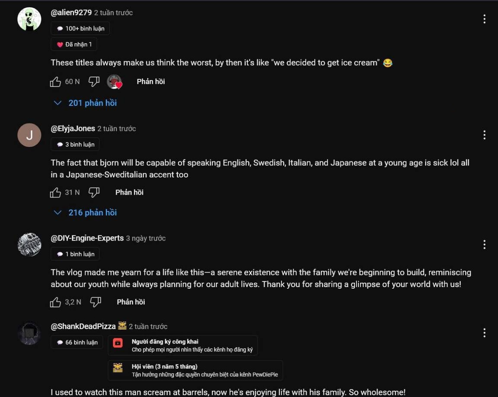
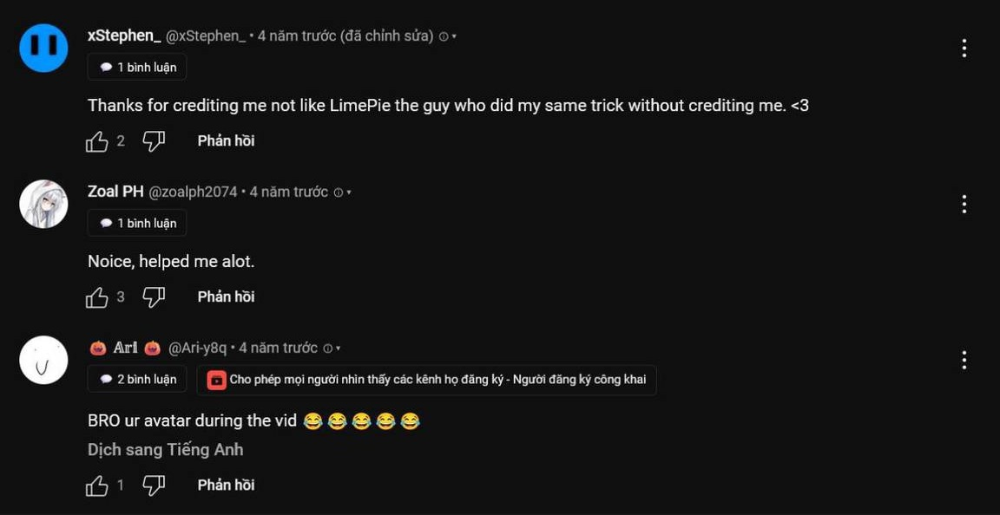

>[!IMPORTANT]
> Because YouTube changed its DOM, this add-on doesn't work anymore.
>[!NOTE]
> Since add-on has to get data from [clicking YouTube comments' profiles](https://support.google.com/youtube/answer/9409333), it's unfeasible to use.

- Step 1: `about:debugging#/runtime/this-firefox` → Temporary Extensions (0): Load Temporary Add-on... → select file → Open (make sure to allow necessary permissions in `about:addons`)
- Step 2: [www.youtube.com](https://www.youtube.com) → select a video to watch → scroll down to the comment section
- Step 3: while add-on is doing its stuff, don't click anything and the more you scroll the more stuff it has to do

